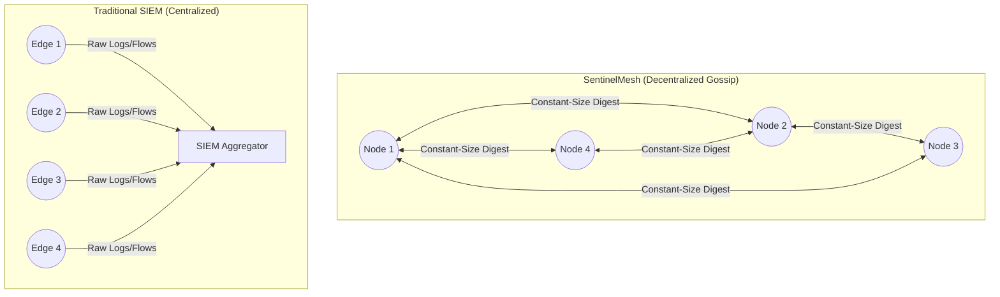
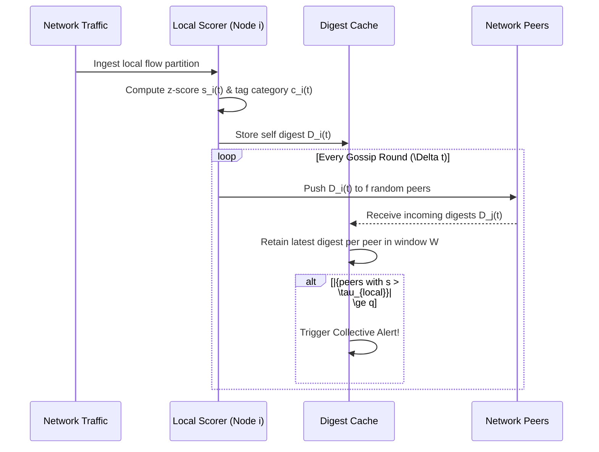

# Design Document: SentinelMesh

## 1. Overview and Context
**SentinelMesh** is a decentralized anomaly correlation framework designed for distributed network intrusion sensing. Modern network defense typically assumes a centralized Security Information and Event Management (SIEM) pipeline. This conventional architecture introduces a single point of failure, a latency bottleneck, and requires sustained bandwidth provisioning proportional to the number of monitored endpoints.

Attackers deliberately exploit this centralized architecture and the per-node thresholding of traditional IDS using *distributed low-and-slow* attacks (e.g., slow-rate distributed port scans, distributed credential-stuffing campaigns). These campaigns generate traffic that appears statistically unremarkable at any single observation point. SentinelMesh addresses this by replacing the centralized aggregator with a lightweight, decentralized **gossip-based correlation** mechanism that operates effectively on resource-constrained infrastructure. 

## 2. Goals and Contributions
- **Decentralized Correlation**: A gossip-based collective anomaly detection protocol using constant-size anomaly digests and a quorum consensus rule, requiring no central aggregator.
- **Simulation Framework**: A discrete-event simulation harness in Go evaluating distributed IDS protocols on partitioned real-world traffic (UNSW-NB15) with engineered cross-node attack fragmentation.
- **Practical Trade-offs**: Empirical characterization of the accuracy–bandwidth–latency trade-off across mesh sizes ($N \in \{8, 16, 32, 64\}$) and gossip fanouts ($f \in \{2, 3, 4\}$) to provide deployment guidance.
- **Demonstrated Efficacy**: Recovers detection capability for fragmented reconnaissance from 8.7% (independent nodes) up to 89.7% at a fraction of the single-point bandwidth cost.

## 3. Architecture Details

### 3.1 Local Anomaly Scoring
Each node $i$ independently observes a partition of network traffic.
- **Scoring Function**: Computes a local anomaly score $s_i(t) \in [0,1]$ over a sliding window.
- **Implementation**: We utilize a per-feature z-score deviation against an exponentially-weighted moving baseline. This provides an $O(1)$ update cost, suitable for constrained nodes.
- **Categorization**: Nodes tag the score with a coarse attack-category hint $c_i(t)$ (e.g., *recon-like*, *dos-like*) derived from heuristics (connection fan-out rate, SYN/ACK ratio). This category acts as the correlation key during gossip aggregation.

### 3.2 Gossip Digest Exchange
At fixed intervals $\Delta t$, each node constructs a constant-size digest:
$$D_i(t) = \langle \text{node\_id}_i, s_i(t), c_i(t), t \rangle$$
- **Push-Gossip Mechanism**: The node transmits $D_i(t)$ to $f$ randomly selected peers.
- **Digest Cache**: Receiving nodes merge incoming digests into a local digest cache $C_j$, retaining the most recent digest per source node within a sliding correlation window $W$.
- **Overhead**: This push-only, constant-fanout design bounds per-node bandwidth to $O(f)$ messages per round, making it independent of the total mesh size $N$.

### 3.3 Quorum-Based Escalation
A node escalates a *collective alert* for category $c$ if, within its digest cache restricted to window $W$, the number of distinct nodes reporting elevated scores ($s_i > \tau_{\text{local}}$) for category $c$ exceeds a quorum threshold $q$.
- **Equation**: $\text{Alert}(c, t) = \mathbb{1}[ |\{i : s_i(t') > \tau_{\text{local}}, c_i(t')=c, t-t'\le W\}| \ge q ]$
- **Transitive Correlation**: Because digests propagate epidemically, correlated signals reach a node transitively. A node does not need direct contact with every contributing node to escalate an alert.

### 3.4 Node Workflow Diagram

## 4. Simulation Methodology

### 4.1 Discrete-Event Simulator
Implemented in Go, the simulator models:
- **Goroutines**: Representing independent nodes.
- **Channels**: Modeling the gossip transport with configurable message latency and loss rates.
- **Execution**: Advances in discrete gossip rounds where nodes select $f$ peers, exchange digests, and evaluate the quorum rule.

### 4.2 Traffic Partitioning and Attack Fragmentation
The simulation utilizes the **UNSW-NB15** test-split flows.
- **Partitioning**: Flows are partitioned across $N$ simulated nodes by source/destination subnet grouping, approximating distinct network segments.
- **Fragmented Reconnaissance**: A single logical campaign's flows are redistributed round-robin across $k$ nodes (where $k \in \{4, 8, 16\}$). Each node observes $1/k$ of the total scan volume, falling below the local detection threshold.
- **Low-Rate Distributed DoS**: Flows are similarly fragmented and rate-limited per-node to bypass volumetric thresholds, while the aggregate request rate remains at attack level.

### 4.3 Baselines for Comparison
1. **Independent (No Coordination)**: Each node applies local thresholds with zero inter-node communication. Represents the status quo for isolated edge IDS.
2. **Centralized Aggregator**: All nodes forward raw digests to a single aggregator every round, which applies the quorum rule with full visibility. Represents conventional SIEM architecture with an equivalent total bandwidth budget.

## 5. Evaluation Metrics and Results

Based on the simulated scenarios, the system is evaluated on:

- **Detection Recall**: Measuring the recovery of detection capability on fragmented attacks. 
  - *Result*: SentinelMesh recovers recall from an abysmal **8.7%** (isolated nodes at $k=16$ fragmentation) up to **80.2% - 89.7%**, closing the gap caused by the structural blind spot of per-node thresholding.
- **Bandwidth Overhead**: Measured in KB/s per node. 
  - *Result*: SentinelMesh maintains near-constant bandwidth ($\sim 1.2$ KB/s at $N=32$, $1.7$ KB/s at $N=64$) compared to linear scaling for the centralized baseline ($\sim 15.1$ KB/s at $N=64$). This is an $8.9\times$ reduction in peak single-point load.
- **Convergence Latency**: The number of rounds until a quorum is reached after attack onset. 
  - *Result*: Grows logarithmically with $N$ (e.g., $1.8$ to $2.6$ rounds as $N$ scales from 8 to 64), maintaining rapid detection (median $2.3$ rounds at $N=32$).
- **Parameter Sensitivity**: Increasing fanout from $f=2$ to $f=4$ improves convergence speed by roughly $30\%$, but $f=3$ offers the best practical balance. A quorum $q=4$ yields a false-positive rate of $2.1\%$, while $q=2$ increases false positives to $7.8\%$.

## 6. Deployment Implications
SentinelMesh offers a robust deployment path for resource-constrained network segments (campus networks, branch offices, IoT clusters) lacking dedicated SIEM budgets. The protocol degrades gracefully: offline nodes simply stop contributing digests without disrupting the remaining nodes, effectively removing the single point of total detection blindness inherent to centralized aggregators.
